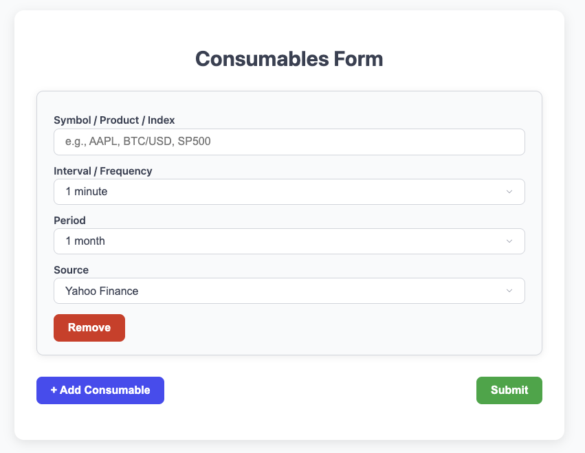
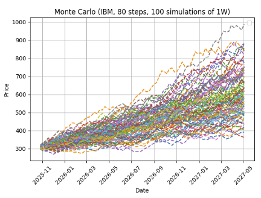
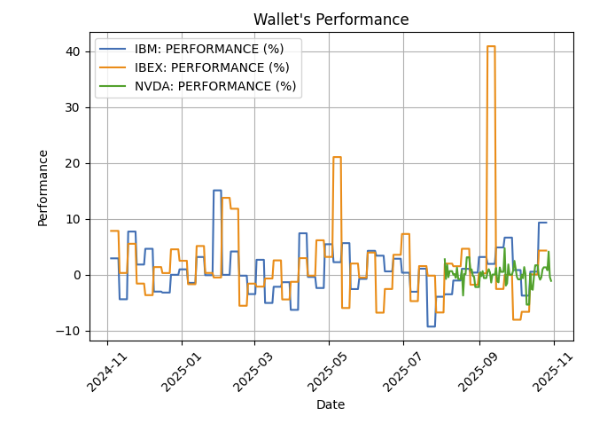
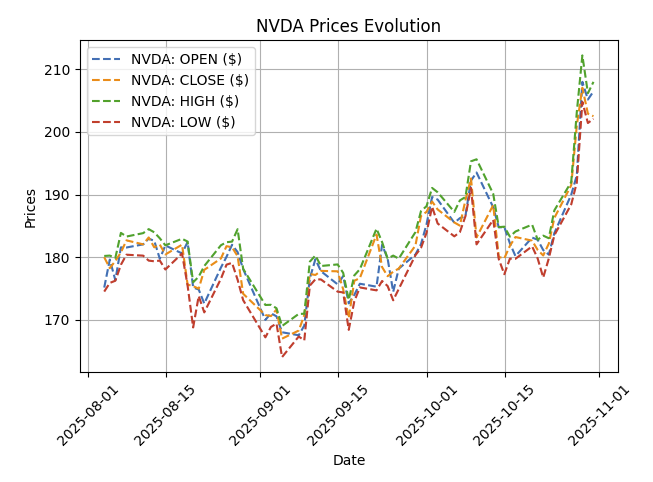

# MIAX Tarea Bloque 1
#### Juan José Daza Linares

## Demo

[Haz click aquí para acceder al live demo](https://miax-tb1.onrender.com)



**Nota**: Al tratarse del plan gratuito, tarda un par de minutos en estar disponible y el rendimiento no es óptimo.

## Introducción

Este proyecto contiene las herramientas necesarias para obtener y mostrar los precios históricos de diferentes APIs de datos de mercados, 
Adicionalmente, es posible obtener un reporte markdown con diferente información relevante de los datos consultados, como por ejemplo:

##### Simulación de Monte Carlo sobre un activo


##### Comparación de rendimientos de una cartera


##### Evolución del histórico de precios


El desarrollo de este proyecto se ha llevado a cabo siguiendo una estructura más cercana a un proyecto en Java, organizada en módulos y clases jerarquizadas con el objetivo de garantizar la claridad, mantenibilidad y coherencia del código.

**La interfaz gráfica de la aplicación web ha sido generada por ChatGPT**, con el siguiente *promt* y algún retoque posterior:
```
Hola ayudame a crear una página web muy sencilla que tenga un formuario con las siguientes opciones
Un elemento dinamico que permita añadir varios de estos componentes, como un grupo: 
* Simbolo producto o índice (texto) 
* Intervalo / Frecuencia de los datos (selector) 
* Periodo (selector) 
* Fuente (selector)
```

**Nota**: *Como posible mejora, los datos disponibles en el formulario podrían obtenerse dinámicamente desde el servidor, por el momento, se encuentran incrustados en el código HTML*.

La implementación del sistema (clases, estructura y lógica funcional) está desarrollada *"manualmente"*, séase, cualquier error en el código, es completamente culpa mía ...

## Ejecución local

### Dependencias

Las dependencias utilizadas se encuentran enumeradas en el archivo *requirements.txt*. Para utilizarlo TODO venv  TODO requirements TODO nose

## Descripción del código

## Notas Adicionales

Este apartado está destinado a responder las cuestiones planteadas en el enunciado de la práctica, así como proporcionar detalles adicionales sobre las decisiones de diseño.

> Hagamos que los datos sean coherentes. Cada serie de datos debe ser un objeto. Crea DataClasses para las series de precios. Existiendo estos objetos, **¿qué es una cartera?**

Una cartera sería una colección de dichos objetos DataClasses. En el caso particular de este proyecto, el objeto Wallet (*wallet.py*) contiene una lista / *array* de objetos DataClass (data_class.py), el cual contiene el histórico de precios.

> Incluye métodos para la “limpieza” y el preprocesado de los datos.

#### Preprocesado

Una vez se obtienen los datos, estos se transforman a un formato común (objeto *Price*, en price.py). Una lista de dichos objetos forman el histórico de precios completo y se utiliza para, posteriormente, tener una forma genérica de traspasar ese mismo histórico a un *Pandas DataFrame*, con el que sea más fácil y eficiente trabajar.

Adicionalmente, se han proporcionado utilidades para reconvertir diferentes muestras de precios a una misma unidad temporal, lo que permite mostrar los activos de una cartera en un mismo gráfico, pudiendo comparar precios, rendimientos, etc.

#### Limpieza
Se ha incluido un método que elimina los valores NaN (en caso de haberlos) de los dataframes que componen cada histórico de precios.

> ¿Debería el programa aceptarte cualquier tipo de input siempre que exista una serie temporal de precios?

Desafortunadamente, no estoy seguro de comprender esta pregunta. Por lo que interpreto de ella, sí, el programa debería aceptar cualquier tipo de entrada de un usuario, ya que debería intentar ser lo más genérico posible. Si dicha entrada no se encuentra entre los valores contemplados durante el desarrollo, debería mostrarse un mensaje al usuario, indicando que la opción no está soportada y mostrando la lista de opciones disponibles.

Por otro lado, aunque la entrada del usuario esté contemplada, si esta no está disponible en la fuente de datos seleccionada; el usuario debe ser notificado de dicha condición.

> Añade métodos a las dataclasses de series de precios que incorporen información estadística relevante. Haz que los métodos para la información más básica (media y desviación típica) se apliquen automáticamente.

Dada la estructura desarrollada para alojar el histórico de precios (*Pandas DataFrame*), los métodos de información estadística no se aplican automáticamente desde la solución desarrollada en sí, sino que se delega en la propia librería de *Pandas* para obtener dichas medidas mediante los métodos std, min, max, mean, etc.